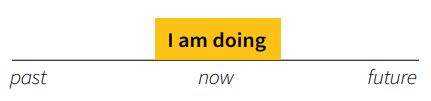
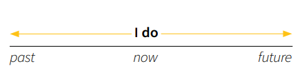
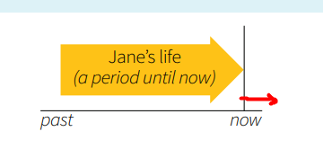
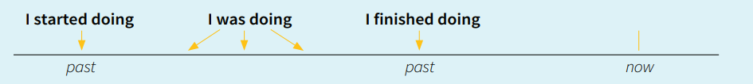
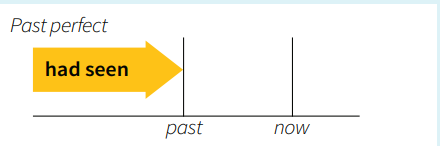
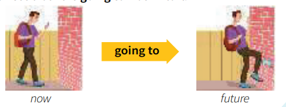
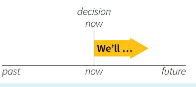
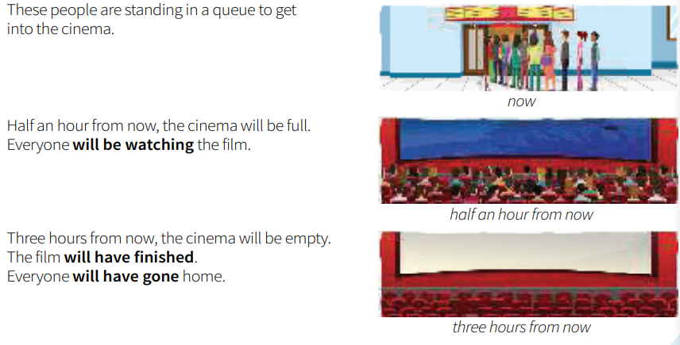

## 1. Type of words
This section categorizes words based on their function in a sentences. 

### 1.1. Articles and nouns

### 1.2. Pronouns and determiners

### 1.3. Verbs

#### 1.3.1. Tenses
Tenses indicate the time of an action or state of being expressed by a verb
##### 1.3.1.1. Present
###### 1.3.1.1.1. Present Continuous ( I am doing)
- **Usage:** Started doing it and I haven't finished. In the middle of doing it.

- **Structure:** 
  - be: `am/is/are being`
  - P: `am/is/are V-ing`
  - N: `am/is/are not V-ing`
  - Q: `am/is/are S V-ing`
  
- **Time expressions:** around now - `at the moment/ currently/ now/ today/ this week/ this year/ ..`
- **Examples:** 
  - `He's being so selfish.` // behaving selfishly now
  - `I'm trying to work.`
  - `I'm not working at the moment`
  - `Are you working today?`

###### 1.3.1.1.2. Present simple ( I do)
- **Usage:** Express habitual actions, general truths, and states of being.

- **Structure:** 
  - be: `am/is/are`
  - P: `V/Vs_es`
  - N: `do/does not V`
  - Q: `do/does S V`
  
- Time expressions: `always/ usually/ often/ sometimes/ rarely/ never/ every day-week-month-year/ on Mondays/ at 5PM/ ..`
- **Examples:** 
  - `He's selfish` // He is selfish generally
  - `I often work in the morning.`
  - `He doesn't do that.`
  - `Do you understand ?`
- see/hear/smell/taste

###### 1.3.1.1.3. Present perfect ( I have done)
- **Usage:** Describe actions that occurred at an unspecified time in the past, actions that **have relevance to the present**, or **experiences** that have happened over a period of time.

- **Structure:** 
  - be: `have/ has been`
  - P: `have/has Vpp`
  - N: `have/has not Vpp`
  - Q: `have/has S Vpp`
  
- **Time expressions:** 
  - `just`: a short time ago
  - `already`: sooner than expected
  - `yet`: until now
  - `since`: specific time
  - `for`: duration
  - `ever`:
  - `never`
  - `in the last few day`:
  - `so far`:
  - `this morning,.`
  - `recently`
- **Examples:** 
  - `We've never had a car`
  - `I haven't seen Tom this morning. Have you ? `
  - `Have you had a holiday this year ?`

- **How long** have you been there ? -> I've been there for a long time.

###### 1.3.1.1.3. Present perfect continuos( I have been doing)
- **Usage:** Describe actions that started in the past and continue into the present or have **recently stopped**, **emphasizing the duration** of the action. 

`She has been working here since 2020.` (This emphasizes that her work started in 2020 and continues to the present.)

----

##### 1.3.1.2. Past
###### 1.3.1.2.1. Past Simple ( I did)
- **Usage:** Started and finished in the past. Emphasizing that the action is complete and has no connection to the present.

- **Structure:** 
  - be: `was/ware`
  - P: `V-ed`
  - N: `did not V`
  - Q: `did S V`
  
- **Time expressions:** `yesterday/ last week-month-year/ in 2010, two days ago, on Monday (past), ..`
- **Examples:** 
  - `I was ill.`
  - `I visited to school last weekend.`
  - `He didn't go to the party last night.`
  - `Did you see that movie? `

###### 1.3.1.2.2. Past Continuous ( I was doing)
- **Usage:** Describe actions that were ongoing at *a specific time in the past*. It indicates that the action started before this time and was still in progress at that time.
- **Structure:** 
  - be: `was/ware being`
  - P: `V-ed`
  - N: `did not V`
  - Q: `did S V`
  
- **Time expressions:** Before ***a specific time*** in the past. (Matt phoned, at 10 o'clock last night, ..While.., ..when..,)
- **Examples:** 
  - `He was being cautious.`  // he was acting in a careful at that time.
  - `Matt phoned while we were having dinner.`
  - `I waved to Helen, but she wasn't looking.`
  - `Were they playing football at 10 o'clock last night.`

###### 1.3.1.2.3. Past Perfect ( I had done)
- **Usage**: Describe an action that was completed before another action or time in the past. It **emphasizes the sequence** of events.

- **Structure:** 
  - P: `had Vpp`
  - N: `had not Vpp`
  - Q: `had S Vpp`
  
- **Time expressions:** `before/ after/ when/ by the time/ already ..`
- **Examples:** 
  - `I had finished my homework before the party started.`
  - `They hadn't seem that movie until last week` // they had not watched the movie up to that point in time.
  - `Had you ever visited Paris before your trip last year?`

###### 1.3.1.2.4. Past Perfect continuous( I had been doing)
- **Usage**:  **Emphasizes the duration**
- `Had you been waiting long before the bus arrived?` // This asks about the duration of the waiting period before the bus arrived.

###### 1.3.1.2.4. Used to
- **Structure:** 
  - `used to V`: refers to past habits or state that are no longer true.
  - `be used to Ving/N`: indicates familiarity or comfort with a situation in the present.

- **Examples:** 
  - `I used to play the game, which was named 3Q, when I was younger.`
  - `I am not used to cold weather.` // The cold weather is unfamiliar for me
----

##### 1.3.1.3. Future
###### 1.3.1.3.1. Present tenses for the future (I do/ I am doing)
- **Usage**: 
  - I do:  Often used for fixed events or timetables (e.g., trains, schedules, public events).
  - I am doing:  Used for personal plans or arrangements, typically those that are already decided or prepared.

- **Examples:** 
  - `The train leaves at 6 PM.` // fixed schedule
  - `We are having a meeting next week` // the plan decided

###### 1.3.1.3.2. I'm going to do

- **Usage**: I’ve decided to do it. Maybe I’ve arranged to do it, maybe not.Often based on current evidence or situations.
- **Examples:** 
  - `I'm going to clean the room` // I've decided to clean them, but I haven't arranged this.
  - `It's going to rain` // see the clouds and make state

> ***was going to**: planed but did not happen: **I was going to call you, but I forgot***

###### 1.3.1.3.3. Future simple ( I will)
- **Usage**: Express actions that will happen at a later time. It often conveys **predictions, spontaneous decisions, promises**, and facts about the future.

- **Structure:** 
  - P: `will V`
  - N: `will not/ won't V`
  - Q: `will S V`
  
- **Time expressions:** `tomorrow/ next week-month-year/ in  few days/ soon/ later`
- **Often use with:**
  - I'll **probably** be home late tonight.
  - **I'm sure** you will ...
  - **I think** I will do ...
  - **I wonder** what will happen.
- **Examples:** 
  - `I had finished my homework before the party started.`
  - `They hadn't seem that movie until last week` // they had not watched the movie up to that point in time.
  - `Had you ever visited Paris before your trip last year?`

###### 1.3.1.3.3. Future continue (I will be doing)
- **Usage**: Describe actions that **will be in progress at a specific point in the future**.  It emphasizes the ongoing nature of the **action during that future time**.

- **Structure:** 
  - P: `will be V-ing`
  - N: `will not/ won't be V-ing`
  - Q: `will S be V-ing`

- **Time expressions:** *specific point in the future* - `at this time/ ...`
- **Examples:** 
  - `I will be working on the project tomorrow afternoon`

###### 1.3.1.3.4. Future perfect (I will have done)
- **Usage**: describe actions that **will be completed before a specific point in the future**. It emphasizes the completion of the action relative to that future time.
- **Structure:** 
  - P: `will have Vpp`
  - N: `will not/ won't have Vpp`
  - Q: `will S have Vpp`

- **Time expressions:** *by + specific point in the future* - `by to morrow/ by the time/ by next week-month-year/ before.. `
- **Examples:** 
- `By this time next week, I will have done my task.`
- `Will you have been there by noon ?`

###### 1.3.1.3.5. Future perfect  continuous (I will have been doing)
- **Usage**: describe actions that **will have been in progress for a duration of time up until a specific point in the future**. It emphasizes the ongoing nature of the action and its duration before that future moment.
- **Structure:** 
  - P: `will have been V-ing`
  - N: `will not/ won't have been V-ing`
  - Q: `will S have been V-ing`

- **Time expressions:** `until now/ since last week/ for two years/ by the end of this month/ by ...for `
- **Examples:** 
- `By the end of this month, I will have been working at the company for five years.`
- `Will you have been living here for a decade by next year` 

----

#### 1.3.2. Modal verbs

#### 1.3.3. Verb patterns -ing and to …

#### 1.3.4. Phrasal verbs

#### 1.3.5. Others

### 1.3. Adjectives and adverbs

### 1.4. Conjunctions and prepositions

### 1.5. Prepositions

### 1.6. Pronouns and determiners

## 2. Types of sentences

### 2.1. Questions and auxiliary verbs

### 2.2. if and wish

### 2.3. Passive

### 2.4. Reported speech

### 2.5. Relative clauses

## 3. Additional Topics

